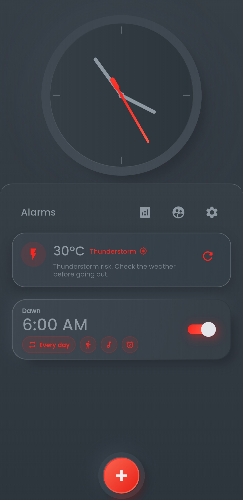
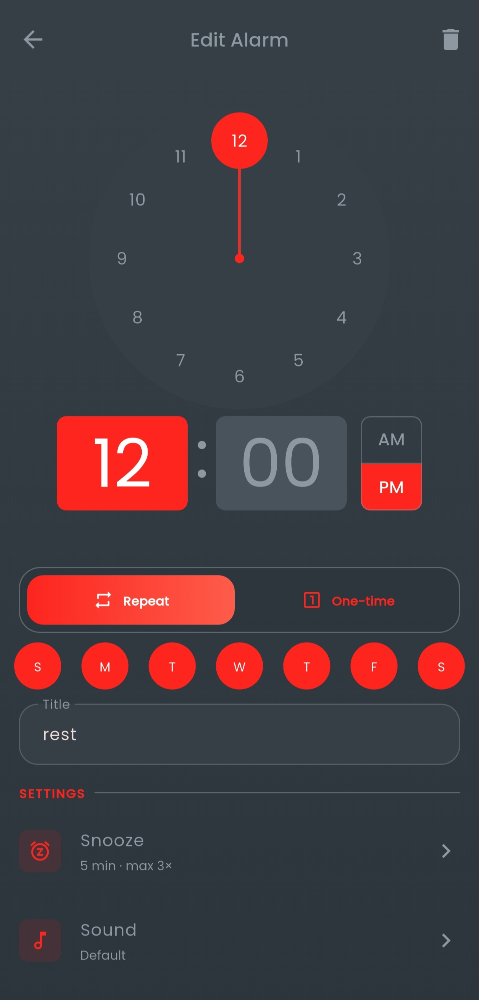
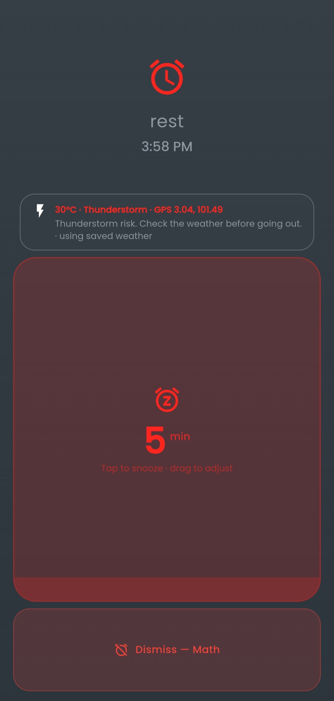
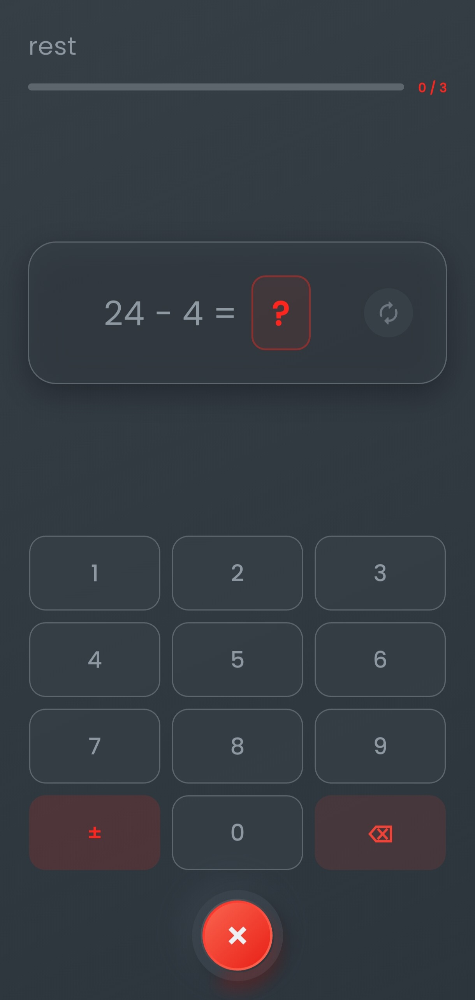
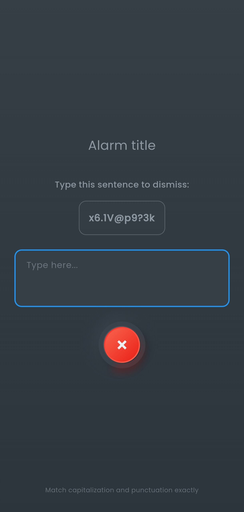
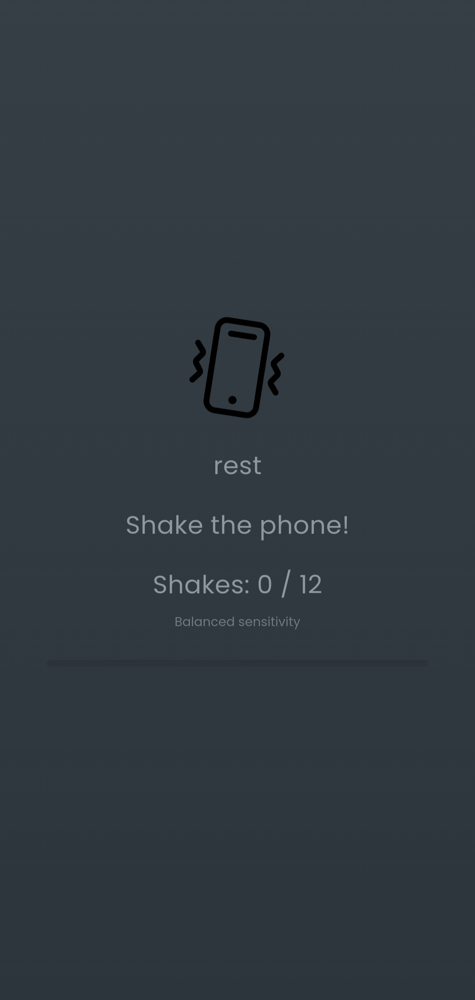
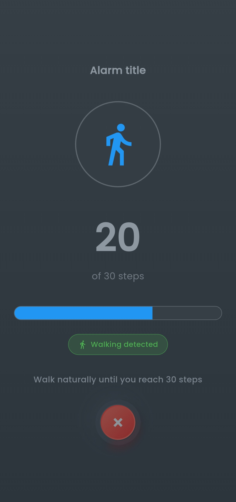
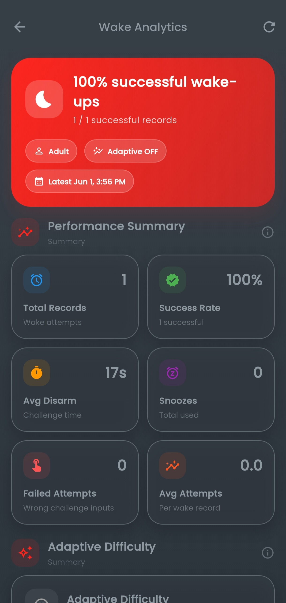
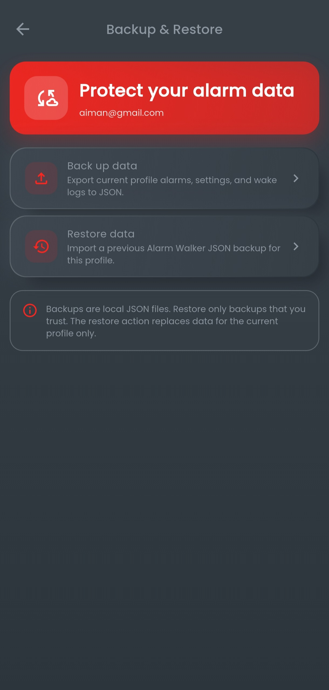
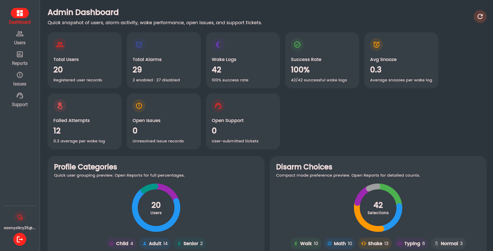

# Alarm Walker

Alarm Walker is a smart alarm mobile application developed as a Final Year Project. The application supports active wake-up behaviour by requiring users to complete wake-up tasks before an alarm can be dismissed.

## Project Overview

Alarm Walker is designed to address passive alarm dismissal by using task-based alarm disarming methods. Instead of only allowing users to stop an alarm immediately, the application encourages alertness through activities such as math tasks, typing tasks, shake tasks, and walking tasks.

The system also includes wake-up analytics, profile-based difficulty settings, snooze support, reminder notifications, and an admin web panel for issue log monitoring.

## Main Features

* Create, edit, and delete alarms
* One-time and repeating alarm support
* Alarm ringing screen with sound and vibration
* Snooze support
* Multi-mode wake-up tasks:

  * Math task
  * Typing / retype task
  * Shake task
  * Walking task
* Profile-based difficulty settings:

  * Child
  * Adult
  * Senior
* Wake history tracking
* Wake-up analytics
* Reminder notifications
* English and Malay interface support
* Admin web panel for issue log and crash monitoring

## Screenshots

### Mobile Application

| Home Screen                                      | Create Alarm                                                     |
| ------------------------------------------------ | ---------------------------------------------------------------- |
|  |  |

| Alarm Ringing                                                | Math Task                                             |
| ------------------------------------------------------------ | ----------------------------------------------------- |
|  |  |

| Retype Task                                               | Shake Task                                              |
| --------------------------------------------------------- | ------------------------------------------------------- |
|  |  |

| Walking Task                                                | Wake Analytics                                                       |
| ----------------------------------------------------------- | -------------------------------------------------------------------- |
|  |  |

| Backup and Restore                                                       |
| ------------------------------------------------------------------------ |
|  |

### Admin Web Panel

| Issue Log Monitoring                                     |
| -------------------------------------------------------- |
|  |

## Platforms

* Android mobile application
* Flutter Web admin panel

## Technology Stack

* Flutter
* Dart
* Firebase
* Local SQLite database
* Render Static Site Hosting for admin web deployment
* GitHub Releases for APK distribution

## Admin Web Panel

The admin web panel is deployed using Render as a Flutter Web static site. It is used to monitor issue logs and crash reports from the mobile application.

**Admin Web URL:**
https://alarm-walker-admin-web.onrender.com/

**Admin Web Deploy Repository:**
https://github.com/Pythoenixx/alarm-walker-admin-web

## APK Release

The final Android APK is distributed through GitHub Releases.

**APK Release URL:**
https://github.com/Pythoenixx/alarm_walker/releases/tag/v1.0.0

## Final Version

**Version:** 1.0.0+6

## Final Testing Status

Final regression testing has been completed and passed. The tested areas include APK installation, alarm creation, alarm ringing, snooze behaviour, wake-up task completion, wake history, wake analytics, notification icon handling, and admin web deployment.

## Notes

This project was developed for academic and demonstration purposes as part of a Final Year Project.
